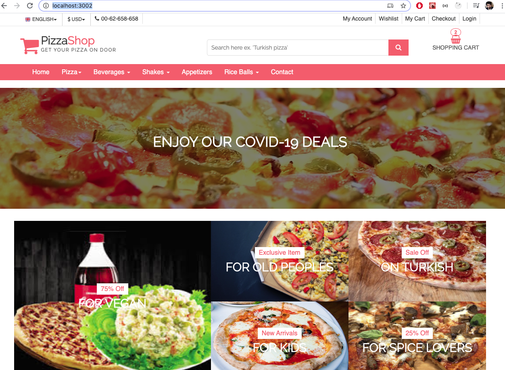

# Pizza-Shop 🍕
## A clean, beautiful and responsive Online Pizza Order Application !

A simple front-end pizza store built using React,I did this project to get more comfortable with React

## Demo Website
👉 Demo : https://piza-shop.herokuapp.com/

## Run Locally 🚀

- git clone git@github.com/AbdulWahab0/Pizza-Shop.git
- cd Piz-Shop
- Run Backend
  - npm install
  - npm start
- Run Frontend
  - open new terminal
  - cd frontend
  - npm install
  - npm start

Let me know if you have any questions. [Email Abdul Wahab ](mailto:wahab3060h@gmail.com)

## Features ✨
* **HomePage** Header (cart,login,),Pizza deal,Showing all pizza information (Price,name).In Home page you can also find infomration about shipping,Deliver Time and Footer.
* **Pizza Details** Shows selected Pizza,price,Stock and also shows Related Pizzas,You can also add pizza to cart.
* **Shopping cart** - Shows you Addded pizza,quanity,price and Subtotal.You can also remove  the added pizza.
* **Checkout page** - for the purposes of this demo website, you can click on 'Fill with fake data' to populate fields. You have login form and your order summary.

## Sections 
✔️ Shows the Deals of Pizzas\
✔️ Shows details of seleted pizza \
✔️ Remove the Pizza from Cart\
✔️ Show subtoal price of  pizza in Cart\
✔️ Show the order summary in checkout.\ 
## Technologies used 🛠️

- [React](https://reactjs.org/)
- [Redux](https://redux.js.org/) 
- [Node.js](https://redux.js.org/) 
- [MongoDB](https://www.mongodb.com/) 
- [Cloud Mongo](https://www.mongodb.com/cloud) 
## Sections 
✔️ Landing Page of Pizza Shop \

 
  <kbd>
  	<a href="#" target="_blank">
		</img>
	</a>
  </kbd>

## Deployment 📦 
Once you have done with your setup. You need to put your website online!
I highly recommend to use [heroku](https://devcenter.heroku.com/articles/nodejs-support/) to achieve this on the EASIEST WAY

## Contributors ✨
<table>
  <tr>
    <td align="center"><a href="https://github.com/AbdulWahab0"> <b>Abdul Wahab</b></a> <a href="https://github.com/AbdulWahab0" title="Code">💻</a> <a href="https://github.com/AbdulWahab0" title="Documentation">📖</a> <a href="https://github.com/AbdulWahab0" title="Design">🎨</a> <a href="https://github.com/AbdulWahab0" title="Maintenance">🚧</a></td>
  </tr>
</table>

 
  <kbd>
  	<a href="https://admiring-jennings-4c377a.netlify.app/" target="_blank">
		</img>
	</a>
  </kbd>

